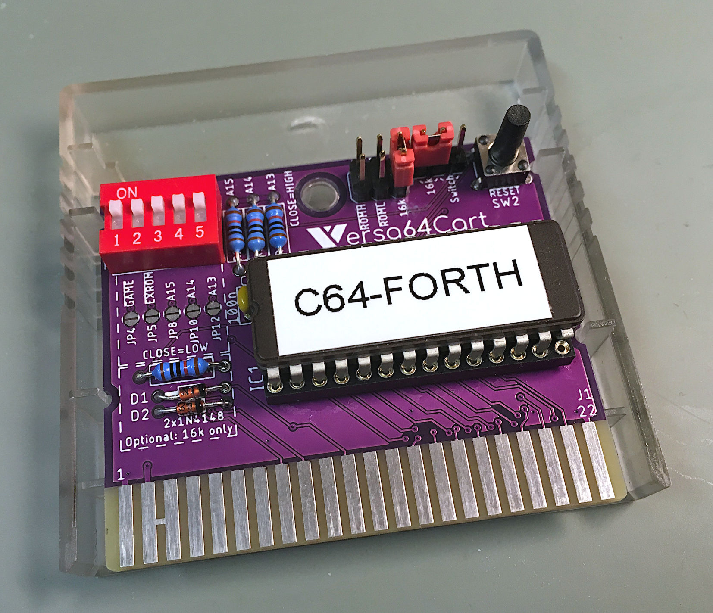
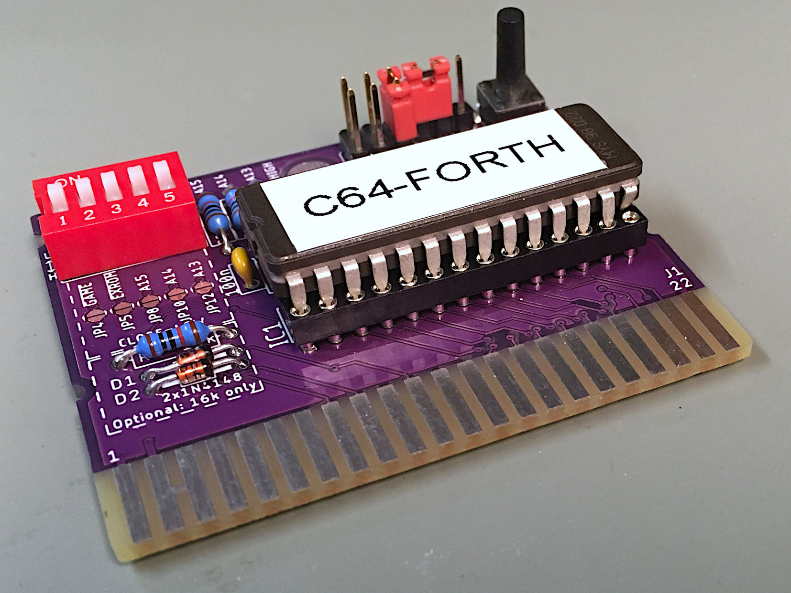
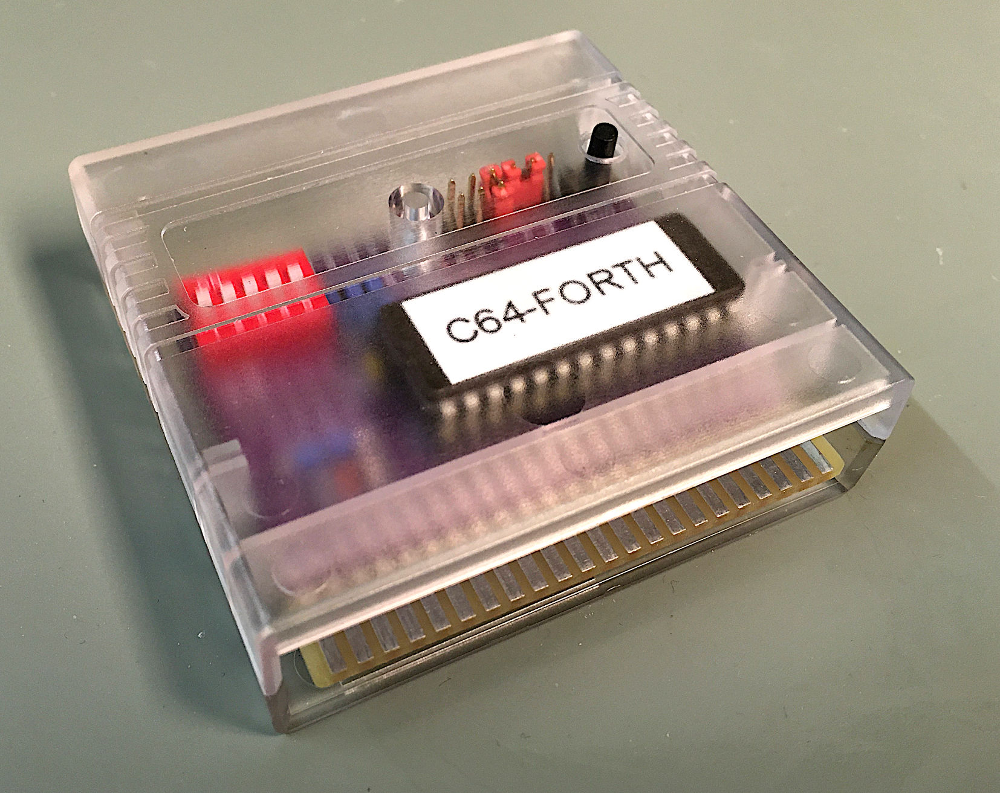
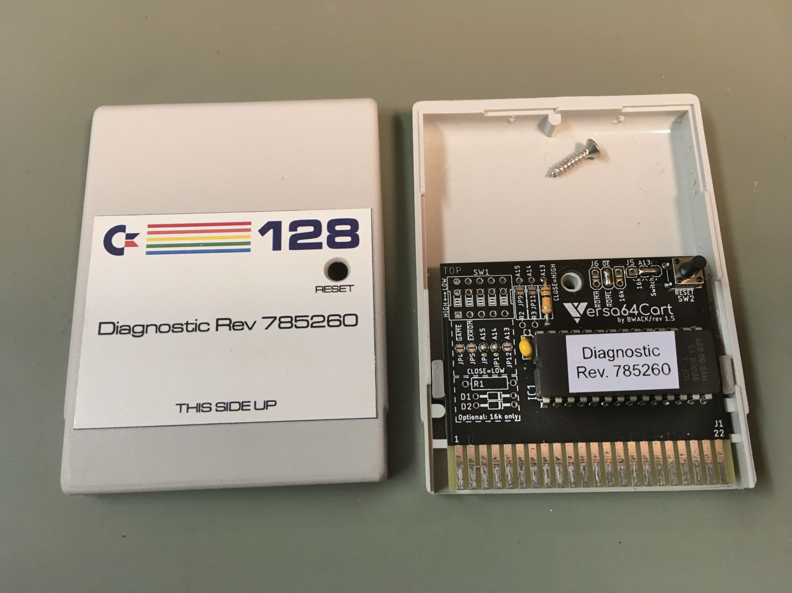
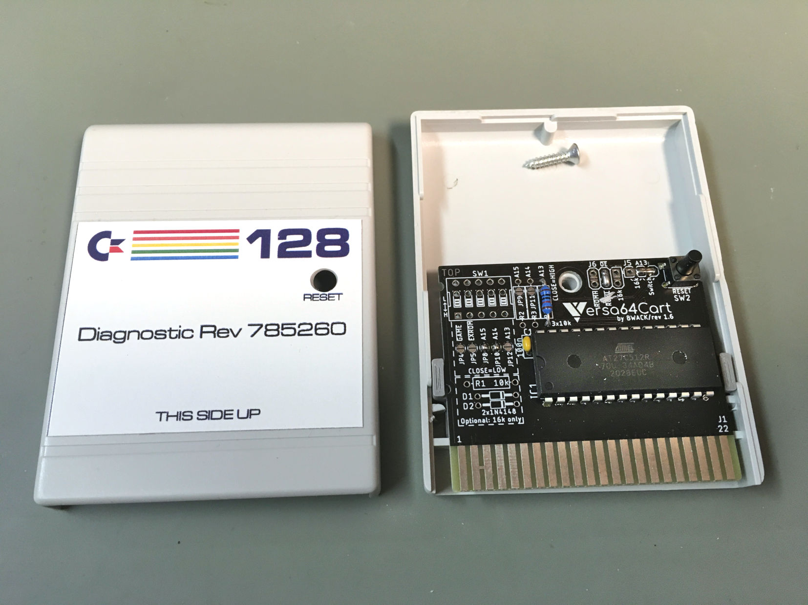
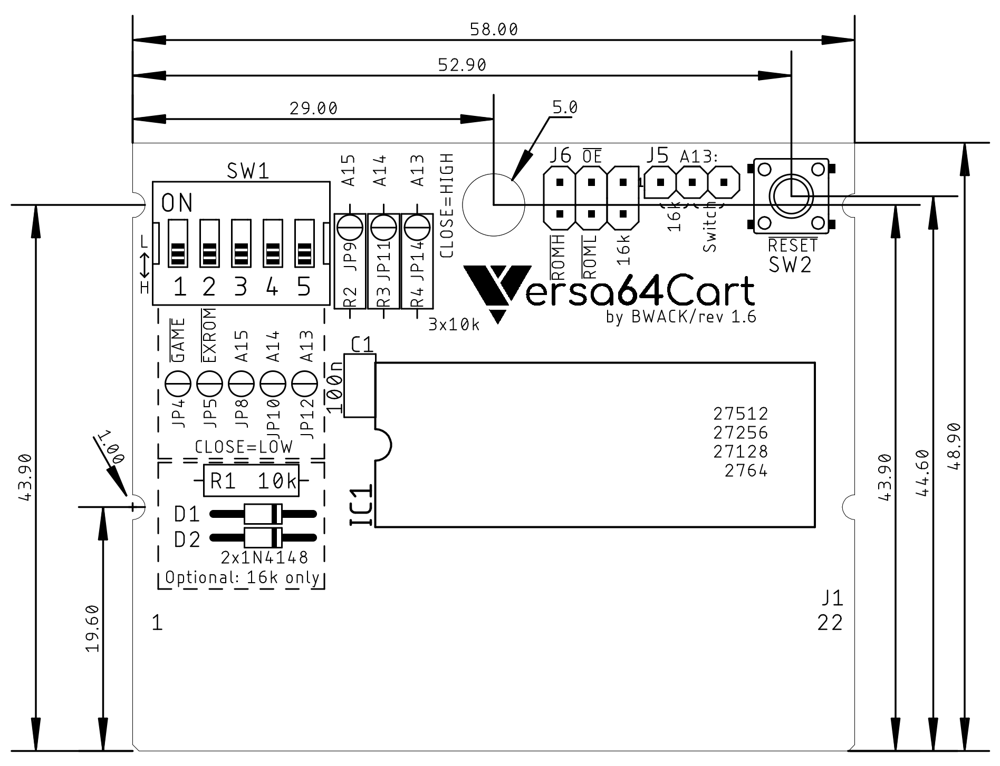
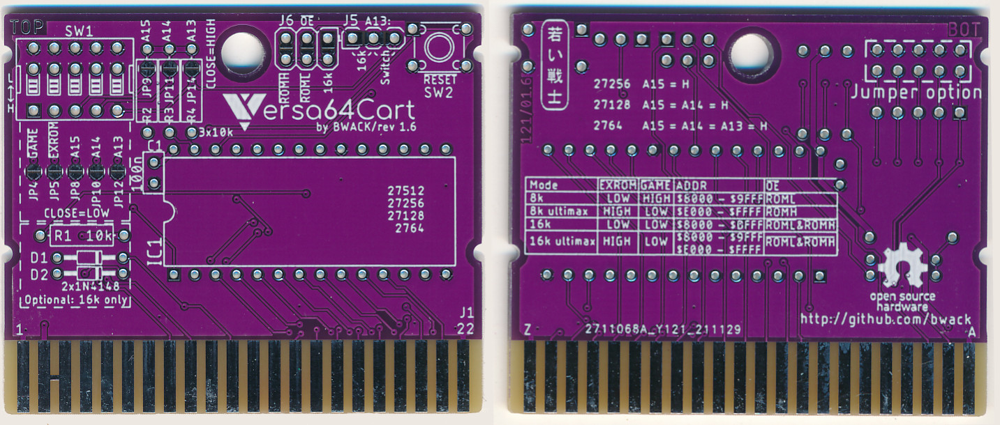

/pictures/logo.png)

<p align="center"></p>

Versa64Cart is designed to be a modern easy-to-use cartridge development board for Commodore 64 and Commodore 128 hobbyists and hackers. The versatile design of the PCB allows for flexible implementation of various cartridge types. Whether it’s a simple cartridge backup of an 8k game or a switchable multi-program diagnostic cartridge, Versa64Cart has you covered.

Supported EPROMS are: 27C64 (8k), 27C128 (16k), 27C256 (32k), 27C512 (64k).
Please see the documentation for more information.

I have put the rev 1.1 in a separate folder in case someone wants to use the kicad files as a template.
Rev. 1.2 and onwards is designed by [Sven Petersen](https://github.com/svenpetersen1965 "Sven's github repository!") in eagle. It is a complete redrawn schematic and layout.

Sven has designed another cartridge called [Diag64cart](https://github.com/svenpetersen1965/Diag64cart) derived from this project.

# Quick Guide

## Obtaining binaries

Use the cartconv.exe tool from the VICE emulator to get information and to extract the binary from .CRT files. Copy it to the same folder as your .CRT files.

List the .CRT information:

```
C:\cartconv>cartconv -f deadtest.CRT
CRT Version: 1.0
Name: C64DEADTESTREV718220
Hardware ID: 0 (Generic Cartridge)
Mode: exrom: 1 game: 0 (ultimax)

offset  sig  type  bank start size  chunklen
$000040 CHIP ROM   #000 $e000 $2000 $2010

total banks: 1 size: $002000
```
The hardware ID must be 0. The size of the eprom shown here is 8k ($2000).

Convert the binary:

`cartconv -i mycartridge.crt -o mycartridge.bin`

## Combining binaries

The Versa64Cart supports EPROMS from 8k to 8x8k or 4x16k. The easiest way to combine is to use the copy command (in Windows):

`copy /b DeadTest.bin + jupiterl.bin + SomeGame.bin combined.bin`

Special care must be taken if mix 8k and 16k images. The 8k binaries must be allocated in pairs:

`copy /b first8k.bin + second8k.bin + some16k.bin combined.bin`

## Documentation

For more information Please see the [pdf file](v1.6/pdf/Versa64cart_v1_6.pdf) in this repository.

## Pictures


<a href="v1.6/pictures/0550_Versa64cart_v1_6.JPG"> </a>
<a href="v1.6/pictures/0551_Versa_in_Stumpy_open.JPG"> </a>
<a href="v1.6/pictures/0552_Versa_in_Stumpy_closed.JPG"> </a>
<a href="v1.6/pictures/0553_-_versa64_in_Z-7_case.JPG"> </a>
<a href="v1.6/pictures/0555_-_versa64_in_KM-20_case.JPG"> </a>




# Changes
## 1.6
- Change: Notches added to fit the thefuturewas8bit.com stumpy cartridge case (not the button hole!)



## 1.5
- Change: Combined footprint SW1, 5Way-DIP and 2x5 2.54mm pin header

## 1.4
- Change: card edge connector with pads like in v1.1

## 1.3
- Change: Cartridge enclosure support
  - Moved IC socket away from edge
  - Moved diode group away from edge
  - Bom: Use right angle pin headers. The straight ones are too tall.
  
## 1.2
- A reset button
- Jumpers accessible on outer edge.*
- Solder jumpers at the top layer
- New documentation
- Designed in Eagle
* Remember to turn off the computer before changing the jumpers.

/pictures/Versa64Cart_scan_both_sides.jpg)

## 1.1 and 1.0

- Designed in KiCad based on simple64cart eagle files
- Support retro innovation cartridge enclosure (allthough pins too high)
- Moved IC sockets further from edge
- Added 16k game support
- Added dip switch and jumpers
- Added Documentation

# Versa64Cart on YouTube

https://www.youtube.com/results?search_query=Versa64Cart

# VersaZIF64
Check out VersaZIF64 if you are interested in the Versa64cart and with a ZIF socket.
https://github.com/bwack/VersaZIF64
